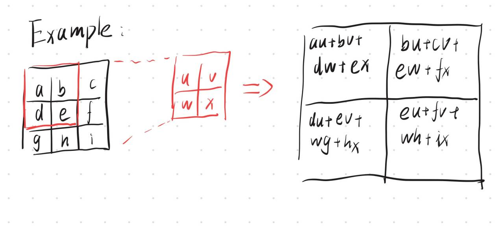
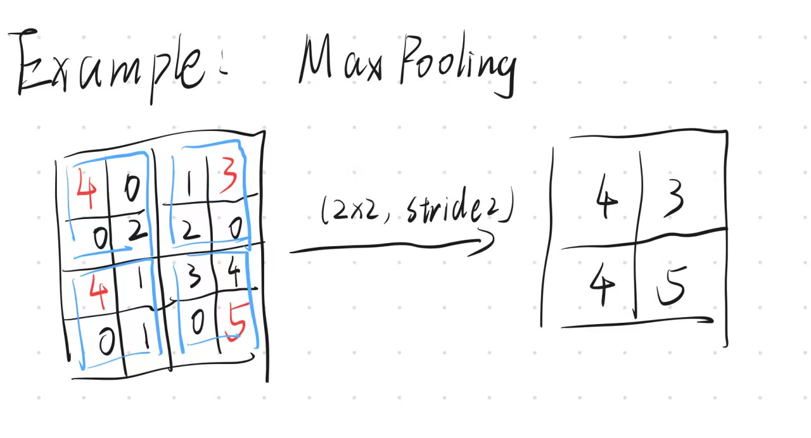
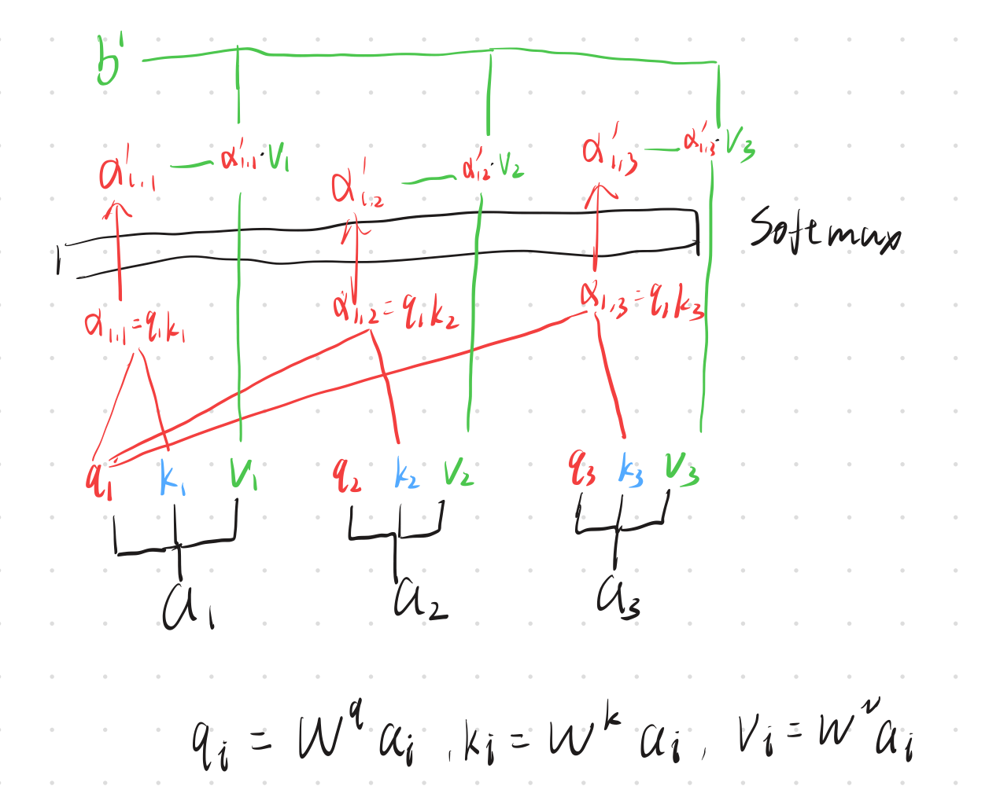

1. 什么是神经网络？
> 神经网络是一种由多个layers组成的计算模型，每个layer中包含被称作神经元的节点，节点代表处理数据的函数。每一层layer接收上一层的output然后通过节点计算后输入到下一层layer，最终输出结果。数据通过在神经网络中正向传播输出output，output和label之间通过损失函数得到loss，然后通过反向传播和梯度下降调整神经网络的参数以最小化loss。
---
2. 什么是损失函数？什么是梯度下降？
> - 损失函数是用来衡量模型输出output与真实label之间差距的函数，常见的有平均绝对误差（MAE）,均方误差（MSE）,交叉熵损失函数。 
> $$MAE = \frac{1}{n} \sum_{i=1}^{n} |y_i - \hat{y}_i|$$ $$MSE = \frac{1}{n} \sum_{i=1}^{n} (y_i - \hat{y}_i)^2$$ $$L_{ce} = -\frac{1}{n} \sum_{i=1}^{n} y_i \log(\hat{y}_i)$$
> - 由神经网络的定义可知，神经网络本质是一个极其复杂，参数量巨大的函数，梯度下降是一种优化算法，通过计算损失函数关于神经网络参数的梯度来更新参数以最小化损失函数。在多元微积分中，函数的梯度是一个向量，指向函数增长最快的方向。通过沿着梯度的反方向更新参数，可以逐步找到损失函数的最小值，从而优化神经网络的性能。

---
3. 什么是训练数据与测试数据？
> - 训练数据是用于训练模型的数据集，模型通过学习这些数据来调整其参数。
> - 测试数据是用于评估模型性能的数据集，模型在训练完成后使用测试数据来验证其泛化能力测，试在未见过的数据上的表现。

---
4. 卷积神经网络前向传播的基本计算过程是怎样的？自注意力机制的核心计算步骤是怎样的？
> - 卷积神经网络（CNN）的前向传播基本计算过程包括卷积层、激活函数、池化层和全连接层。卷积层通过卷积操作提取输入数据的特征，激活函数引入非线性，池化层减少特征图的尺寸以降低计算复杂度，全连接层将提取的特征映射到输出空间。
> 卷积层指卷积核在输入数据上滑动，计算卷积核与输入数据的点积，提取局部特征。
> 激活函数如ReLU将卷积层的输出进行非线性变换。 $$ReLu(x)=\begin{cases}x, & x>0 \\ 0, & x \leq 0\end{cases}$$
> 池化层如最大池化通过取局部区域的最大值或平均池化取局部平均值来降低图的尺寸，达到简化计算的目的；当图的尺寸缩小后，同样大小的卷积核可以有更大的感受野。 
> 全连接层将前面提取的特征展平，然后做非线性映射，如分类任务中计算各个类别的概率。
> - 自注意力机制的核心计算步骤包括：
> 1. 通过可学习矩阵计算Query，Key，Value向量 $$q_i = W^q x_i, k_i = W^k x_i, v_i = W^v x_i$$ 
> 2. 计算注意力权重 $$\alpha_{ij} = \frac {q_i k_j}{\sqrt{d_k}}$$ $$\alpha'_{ij}=\frac{exp(\alpha_{ij})}{\sum exp(\alpha_{ij})}$$ 
> 3. 加权求和 $$b_i = \sum \alpha'_{ij} v_j$$

> 综上所述 $$Q=XW^Q,K=XW^K,V=XW$$ $$Attention(Q,K,V)=softmax(\frac {QK^T} {\sqrt{d_k}})V$$

---
5. 监督学习是什么，无监督学习是什么？聚类属于哪一种？
> - 监督学习是指模型在训练过程中使用带有标签的数据集，模型通过学习输入数据与对应标签之间的关系来进行预测。
> - 无监督学习是指模型在训练过程中使用不带标签的数据集，模型通过发现数据中的模式和结构来进行学习。比如训练LLM时，输入的文本数据没有对应的标签，模型通过遮盖部分文本来预测被遮盖的部分，从而学习语言的结构和语义。
> - 聚类属于无监督学习。
